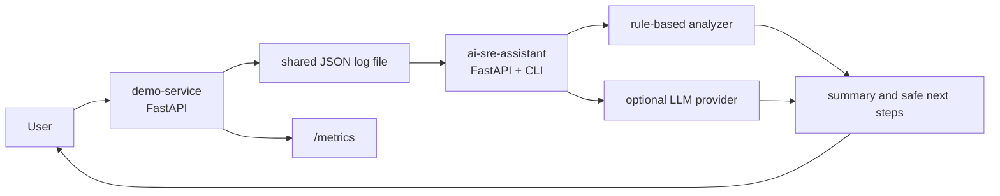

# Architecture

The project uses two small services and one shared signal path.

## Components

`demo-service` exists to produce realistic operational signals. It has healthy requests, intentional failures, latency spikes, memory pressure, and structured logs.

`ai-sre-assistant` exists to show how AI can help with operations when it is grounded in evidence. It reads logs, summarizes facts, makes limited guesses, and suggests safe debugging steps.

The shared file log is intentionally simple. It is not the production answer. It is the Day 1 bridge between a service and an assistant.

